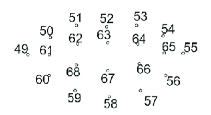
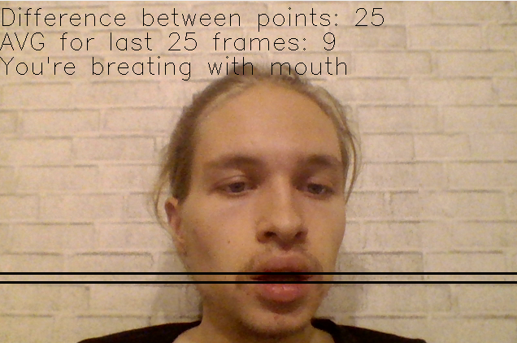
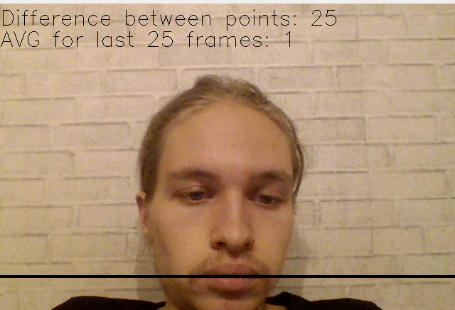

# Mouth_Breath_Detector
Detect mouth-breathing by video-camera-input using facial-landmarks:
- Working with OpenCV taking frames by video-camera input
- Detect face with custom SSDFaceDetector
- Detect facial landmarks with Dlib
- Find lowest top lip point and highest bottom lip point on Y-axis
- Draw line by this points and calculate difference in pixels (and draw text)
- Making buffer of 25 latest calculation (same as 25 FPS)
- If the AVG difference in buffer more than 2 - You're breating with mouth (draw text)
- Stopping application by pressing 'Q'

# Lip points

Find lowest top lip point and highest bottom lip point for top-lip[62-64] and bottom-lip[61-63] points

# Examples
Breating with mouth:

Normal breating:

# Install

You need Python 3 and Pip install.

Cloning:

>git clone https://github.com/Ustelemov/Mouth_Breath_Detector

Install requirements:

>pip install -r requirements.txt

Download model for Dlib

>cd models

>wget -nd https://github.com/JeffTrain/selfie/raw/master/shape_predictor_68_face_landmarks.dat

Running 

>python3 main.py

Stopping

>Press Q to Stop